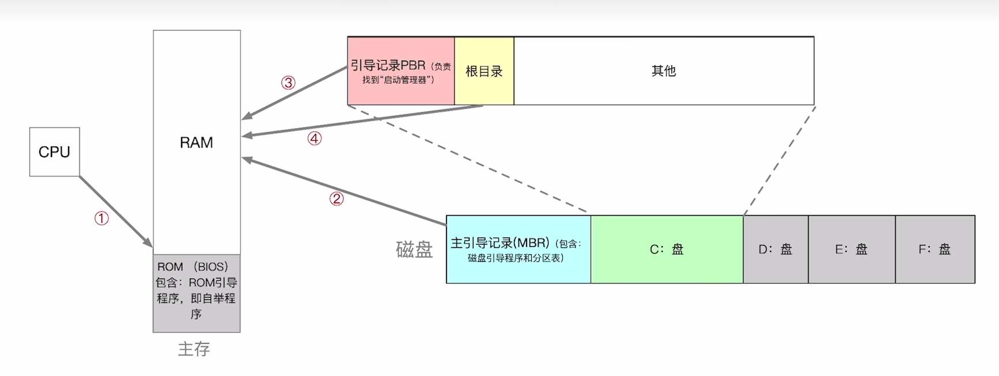
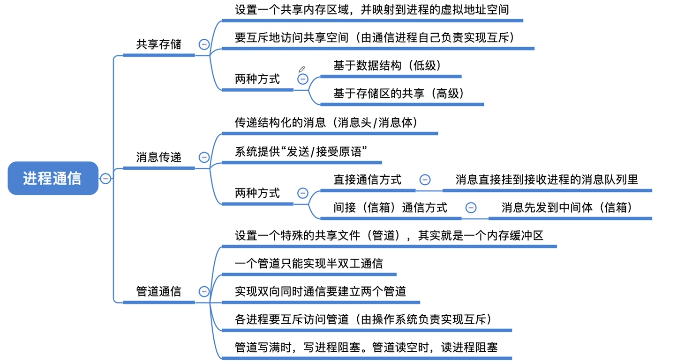
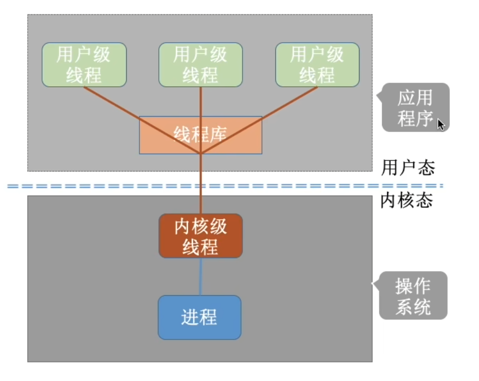
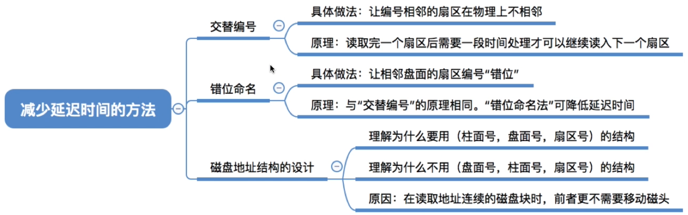

# 操作系统

根据B站上[王道考研](https://www.bilibili.com/video/BV1YE411D7nH/?spm_id_from=333.337.search-card.all.click&vd_source=cce665518025293a4c10cf543a903f00)做的笔记

## 1. 操作系统基础

### 1.1. 概念

***操作系统：***

- 控制和管理整个计算机系统的硬件和软件资源，并合理地组织调度计算机的工作和资源的分配
- 提供给用户和其他软件方便的接口和环境
- 是计算机系统中最基本的系统软件

操作系统的四大特征

- 并发：与共享互为存在条件
  - 宏观上同时，微观上交替
  - 并行：同时发生
- 共享
  - 资源共享；系统中的资源可供内存中多个并发执行的进程共同使用
  - 互斥共享方式：一个资源一个时间只允许一个进程访问
  - 同时共享方式：一个资源一个时间允许多个进程交替访问
- 虚拟：有并发才有虚拟
  - 把一个物理上的实体变为若干个逻辑上的对应物
  - 空分复用技术（虚拟存储技术）
  - 时分复用技术（虚拟处理器技术）
- 异步：有并发才会有异步
  - 在多道程序环境下，允许多个程序并发执行，但是资源有限，会导致阻塞发生，程序可能不会一贯到底

### 1.2. 运行机制

内核程序：操作系统内，直接操作硬件的程序

内核：(操作系统内核)：由许多的内核程序组成

CPU两种状态

- 内核态：(核心态、管态)
  - 处于内核态，运行内核程序，可以执行特权指令
- 用户态：(目态)
  - 出于用户态，运行应用程序，只能执行非特权指令
- 程序状态字寄存器(PSW)，内含一个二进制位；1表示内核态；0表示用户态
- 内核态 -> 用户态：执行一条 特权指令：修改PSW的标志位为用户态。 该操作意味着操作系统将主动让出CPU使用权
- 用户态 -> 内核态：由中断引发，硬件自动完成变态过程，出发中断信号意味着操作系统将强行多会CPU的使用权

### 1.3. 中断和异常

中断

- 内中断：与当前执行的指令有关，中断信号来源于CPU内部（称为异常）
  - 故障：当前执行的指令是非法的，由错误条件引起，可能会被内核程序修复，修复后还会把CPU使用权归还应用程序
  - 陷入：应用程序需要操作系统内核的服务，执行一条特殊的指令--陷入指令
  - 终止：由致命错误引起，内核程序无法修复错误
- 外中断：与当前执行的指令无关，中断信号来源于CPU外部（狭义的中断）
  - 时钟中断--由时钟内部发来的中断信号
  - I/O中断请求

中断机制的基本实现原理

- 检查中断信号
  - 内中断：CPU在执行指令时会检查是否有异常发生
  - 外中断：每个指令周期末尾，CPU会检查是否有外中断信号需要处理
- 找到相应的中断处理程序
  - 通过 中断向量表 实现

### 1.4. 系统调用

类似于编程语言提供库函数供上层应用程序调用，操作系统也提供一些系统调用以供上层调用

库函数好多都会进行系统调用，这些库函数可以认为是把系统调用封装了一下

系统调用（按功能分类）

- 设备管理
  - 完成设备的 请求、释放、启动等功能
- 文件管理
  - 完成文件的 读、写、创建、删除等功能
- 进程控制
  - 完成进程的 创建、撤销、阻塞、唤醒等功能
- 进程通信
  - 完成进程间的 消息传递、信号传递等功能
- 内存管理
  - 完成内存的 分配、回收等功能

传递系统调用参数 -> 执行陷入指令(用户态) -> 执行相应的请求内核程序处理系统调用(核心态) -> 返回应用程序

注意：

- 陷入指令是在用户态执行，执行之后立即引发一个内中断，使得CPU进入核心态
  - 陷入指令：trap指令：访管指令
- 发出系统调用请求是在 用户态 ，而对系统调用的处理是在 核心态

### 1.5. 体系结构

- 大内核
  - 将操作系统的主要功能模块都作为系统内核，运行在核心态
  - 优点：性能高
  - 缺点：内核代码庞大，结构混乱，难以维护
  - Linux、UNIX都是
- 微内核
  - 只把最基本的功能保留在内核
  - 优点：内核功能少，结构清晰，方便维护
  - 缺点：需要频繁的在核心态和用户态之间切换，性能低
  - Windows NT

- 分层结构
  - 每层可以 “单向” 调用 “更低一层” 提供的接口
  - 优点：
    - 便于调试和验证，自底向上主层调试验证
    - 易于扩充和维护，各层之间调用接口清晰固定
  - 缺点：
    - 仅可以调用相邻低层，难以合理定义各层的边界
    - 效率低，不可跨层调用，系统调用执行时间长

- 模块化
  - 将内核划分为多个模块，各模块间相互协作
    - 内核 = 主模块 + 可加载内核模块
    - 主模块：只负责核心功能：进程调度、内存管理
    - 可加载模块：可以动态加载新模块到内核，无需重新编译整个内核
  - 优点：
    - 模块间逻辑清晰易于维护，确定模块间接口后可以多模块同时开发
    - 支持动态加载新的内核模块，增强OS适应性（就是可以加载上新的设备驱动程序、文件系统...）
    - 任何模块都可以直接调用其他模块，无需采用消息传递进行通信，效率高
  - 缺点：
    - 模块间接口定义未必合理
    - 模块间相互依赖，难以调试和验证

- 外核
  - 内核负责进程调度、进程通信等功能。
  - 外核负责为用户进程分配未经抽象的硬件资源，且由外核负责保证资源使用安全
    - 抽象的地址空间：把一片散乱的地址空间，通过逻辑链接起来，让你感觉上它们是连在一片的
    - 未经抽象的地址空间：实实在在的一块地址空间
  - 优点：
    - 外核可直接给用户进程分配未经抽象的硬件资源，使得用户进程可以更灵活的使用硬件资源
    - 减少了虚拟硬件资源的 “映射层”，提升效率
      - 虚拟的、逻辑生成的，都需要通过映射来连接起来
  - 缺点：
    - 降低了系统的一致性
      - 有的是需要映射，有的不需要
    - 使系统变得更复杂

### 1.6. 操作系统的引导

就是开机的时候，操作系统如何运行起来

1. CPU从一个特定主存地址开始取指令，执行ROM中的引导程序
   1. 先进行硬件自检，再开机
2. 将磁盘的第一块--主引导记录 读入内存，执行磁盘引导程序，扫描分表
3. 从活动分区读入分区引导记录，执行其中的程序
   1. 活动分区：安装了操作系统的分区
4. 从根目录下找到完整的操作系统初始化程序(启动管理器)并执行，完成开机

### 1.7. 虚拟机

使用虚拟化技术，将一台物理机器虚拟化为多台虚拟机器，每个虚拟机器都可以独立运行一个操作系统。

虚拟机管理程序/虚拟机监控程序/Virtual Machine Mointor/Hypervisor

|  | 第一类VMM | 第二类VMM |
|--|--|--|
| 对物理资源的控制权 | 直接运行在硬件上，能直接控制和分配物理资源 | 运行在Host OS之上，依赖于Host OS为它分配物理资源 |
| 资源分配方式 | 安装Guest OS时，VMM要在原本的硬盘上自行分配存储空间，类似 外核 的分配方式，分配未经抽象的物理硬件 | Guest OS拥有自己的虚拟磁盘，该磁盘实际是Host OS文件系统中的一个大文件，Guest OS分配到的内存是虚拟内存 |
| 性能 | 性能更好 | 较差，Host OS作中间商 |
| 可支持的虚拟机数量 | 更多，不需要和Host OS竞争资源 | 更少，Host OS本身也需要使用物理资源，Host OS上其它进程也需要资源 |
| 虚拟机的可迁移性 | 更差 | 更好，导出镜像文件就好 |
| 运行模式 | 第一类VMM运行在更高特权级，可以执行最高特权的指令 | 部分运行在用户态、部分运行在内核态 |

## 2. 进程管理

### 2.1. 进程与线程

#### 2.1.1. 进程实体

- PCB
  - 进程描述信息
  - 进程控制和管理信息
  - 资源分配清单
  - 处理机相关信息
- 程序段
  - 程序的代码
- 数据段
  - 运行过程中产生的各种数据

进程的特性

- 动态性
  - 进程是程序的一次执行过程，是动态的产生、变化和消亡的
- 并发性
  - 内存中有多个进程实体，个进程可并发执行
- 独立性
  - 进程是能独立运行、独立获得资源、独立接收调度的基本单位
- 异步性
  - 各进程按各自独立的、不可预知的速度向前推进，操作系统要提供 ‘进程同步机制’ 来解决异步问题
- 结构性
  - 每个进程都会配置一个PCB。从结构上看，进程由程序段、数据段以及PCB组成

#### 2.1.2. 进程的状态与转换

- 状态
  - 运行态：进程正处于CPU上运行
  - 就绪态：具备运行条件，但是没有空闲CPU
  - 阻塞态：在运行中，因为等待某个事件而被下CPU
  - 创建状态：进程整备创建，在这个阶段操作系统会为进程分配资源、初始化PCB
  - 终止状态：进程运行结束
- 状态间的转换
  - 就绪态 -> 运行态：进程被调度
  - 运行态 -> 就绪态：时间片用完、处理机被强占
  - 运行态 -> 阻塞态：进程用 “系统调用” 的方式申请某种系统资源，或者请求等待某个事件发生
  - 阻塞态 -> 就绪态：申请的资源被分配、等待的事件发生
  - 运行态 -> 终止态：进程运行结束，或者运行过程中遇到不可修复的错误
- 进程的组织方式(各个进程PCB的组织方式)

***进程的组织***

进程的组织方式

- 链接方式
  - 按照进程状态将PCB分为多个队列
  - 操作系统持有指向各个队列的指针
- 索引方式
  - 根据进程状态的不同，建立几张索引表
  - 操作系统持有指向各个索引表的指针

#### 2.1.3. 进程控制

就是实现进程状态转化

通过进程控制原语来控制

- 创建原语：创建一个进程
  - 申请空白PCB
  - 为新进程分配所需资源
  - 初始化PCB
  - 将PCB插入就绪队列
- 撤销原语：终止一个进程时
  - 从PCB集合汇总找到终止进程的PCB
  - 若进程正在运行，立即剥夺CPU，将CPU分配给其他进程
  - 终止其所有子进程
  - 将该进程拥有的所有资源归还给父进程或操作系统
  - 删除PCB
- 阻塞原语
  - 找到要阻塞的进程对应的PCB
  - 保护进程运行现场，将PCB状态信息设置为阻塞态，暂时停止进程运行
  - 将PCB插入相应事件的等待队列
- 唤醒原语
  - 在事件等待队列中找到PCB
  - 将PCB从等待队列移除，设置进程为就绪态
  - 将PCB插入就绪队列，等待被调度
- 切换原语：将一个进程从运行态->就绪态，将另一个进程从就绪态->运行态
  - 将运行环境信息存入PCB
  - PCB移入相应队列
  - 选择另一个进程执行，更新其PCB
  - 根据PCB恢复新进程所需的运行环境

#### 2.1.4. 进程通信

- 共享存储
  - 基于数据结构的共享
    - 共享空间里只能存放一个长度为10的数组
    - 这样共享方式限制很大，速度慢，是低级通信
  - 基于存储区的共享
    - 操作系统在内存中划出一块内存存储区
    - 数据的形式、存放位置都由通信进程控制
    - 速度快，是一种高级通信方式
- 消息传递：以格式化的消息为单位，进程通过操作系统提供的“发送消息/接收消息”两个原语进行数据交换
  - 直接通信方式
    - 发送进程要致命接收进程的ID
  - 间接通信方式
    - 通过 信箱 间接的通信
- 管道通信

#### 2.1.5. 线程

用户级线程：由用户自定义逻辑实现多线程

内核级线程：由操作系统支持的线程

一对一模型

多对一模型

多对多模型

### 2.2. 处理机调度

#### 2.2.1. 三个调度层次

- 高级调度：作业调度
  - 作业：一个具体的任务
  - 按照一定的原则从 外存的作业后备队列 中挑选一个作业调入内存，并创建进程。
  - 每个作业只调入一次，调出一次
  - 调入创建PCB，调出撤销PCB
- 低级调度：进程调度/处理机调度
  - 按照某种策略从 就绪队列 中选取一个进程，将处理机分配给它。
  - 进程调度是操作系统中最基本的一种调度
- 中级调度：内存调度
  - 内存不够时，将某些进程的数据调出外存。等内存空闲或者进程需要运行时再 重新调入内存
  - 暂时调出到外存的进程状态为挂起状态。被挂起的进程PCB会被组织成挂起队列
  - 一个进程可能会被多次调出、调入内存，因此中级调度发生的频率比高级调度高

|  | 要做什么 | 调度发生在 | 发生频率 | 对进程状态的影响 |
|--|--|--|--|--|
| 高级调度(作业调度) | 从后备队列中选择合适的作业将其调入内存，并为其创建进程 | 外存->内存(面向作业) | 最低 | 无->创建态->就绪态 |
| 中级调度(内存调度) | 从挂起队列中选择合适的进程将其数据调回内存 | 外存->内存(面向进程) | 中等 | 挂起态->就绪态 |
| 低级调度(进程调度) | 从就绪队列中选择一个进程为其分配处理机 | 内存->CPU | 最高 | 就绪态->运行态 |

#### 2.2.2. 进程调度时机、切换、调度过程、调度方式

***进程调度时机***

***不可进行进程调度***

临界资源

- 一个时间段内只允许一个进程使用的资源。个进程需要互斥的访问临界资源

临界区

- 访问临界资源的那段代码

进程切换

1. 对原来运行进程各种数据的保护
2. 对新进程的各种数据的恢复
3. 它会付出相应的代价，要有合适的切换频率

调度器和闲逛进程

- 调度器需要关注的
  - 让哪个进程上处理器
  - 上多久
- 闲逛进程
  - 没有需要上处理器的进程了，就弄个啥都不干的闲逛进程上去，周期性的中断查看有无需要上处理器的进程

#### 2.2.3. 调度算法

***调度算法的评价指标***

***调度算法***

***先来先服务算法***

***短作业优先算法***

***高响应比优先算法***

***时间片轮转算法***

***优先级调度算法***

***多级反馈队列调度算法***

***多级队列调度算法***

- 系统按照进程类型设置多个队列，进程创建成功后插入某个队列
- 队列间可采用固定优先级或时间片划分
  - 固定优先级可能导致最低优先级的队列饿死
  - 时间片划分可以给优先级高的时间多一些，最低的也会有一口吃的，不会饿死
- 队列内可以采用不同的调度策略，要看这个队列都是点啥进程了，灵活使用

### 2.3. 进程同步和互斥

临界区：不允许同时访问的区域

***同步互斥原则***

***进程互斥的软件实现方法***

**单标志法：** 两个进程在访问完临界区后会把使用临界区的权限转交给另一个进程。

- turn标志：turn = 0 表示进程0可以上处理机
  - ...
- 不符合空则让进的原则

**双标志后检查法：** 设置一个布尔值数组flag[]，数组内各个元素用来标记各个进程想要进入临界区的意愿

- 并发运行时可能违反了忙则等待的原则

**双标志先检查法：**

- 违背了空闲让进和有限等待原则
- 可能会导致饥饿

**Peterson算法：** 结合双标志法和单标志法

- 未遵循让权等待的原则

***互斥的软件实现方法***

***进程的硬件实现方法***

**中断屏蔽方法：** 利用 开/关中断指令 实现。

- 在进程开始访问临界区到结束访问临界区都不允许被中断，就不存在了进程切换
- 问题：
  - 多处理机会同时运行多个进程，所以不适用
  - 只适用于操作系统内核进程
    - 开关中断指令只能运行在内核态

**TestAndSet指令：** 用硬件的方法把上锁和检查操作变为一个原子操作

- 不满足让权等待的原则

**Swap指令：** 同上

#### 2.3.1. 信号量机制

信号量：用信号量来表示系统中某种资源的数量

- 用户进程可以通过使用操作系统提供的一对原语对信号量进行操作，从而很方便的实现进程互斥、进程同步
  - wait原语和signal原语，也被称为P、V操作
  - wait原语：给进程一个资源
  - signal原语：进程还回去资源
- 信号量就是一个变量
  - 整形信号量
    - 用一个整数表示系统中某种资源的数量
  - 记录型信号量

信号量机制能够很好的解决进程互斥和进程同步的问题

***整形信号量***

***记录型信号量***

***信号量机制***

#### 2.3.2. 信号量机制实现 进程互斥、进程同步、进程的前驱关系

实现互斥：就是成对的使用P，V操作

实现同步：让进程有相对的顺序，那就使用P操作阻塞一个进程，使用V操作释放阻塞，那么就必须先执行V操作之前的代码才能实现P操作之后的代码

***前驱关系***

***信号量机制实现技巧***

#### 2.3.3. 管程

管程：一种高级的同步机制

- 管程的构成
  - 局部于管程的共享数据结构说明
  - 对该数据结构进行操作的一组过程
    - 过程就是函数
  - 对局部于管程的共享数据设置初始值的语句
  - 要有一个名字
- 基本特征
  - 局部于管程的数据只能被局部于管程的过程所访问
  - 一个进程只有通过调用管程内的过程才能进入管程访问共享数据
  - 每次仅允许一个进程在管程中执行某个内部过程
- 可以想象成 单例的类

### 2.4. 死锁

**死锁：** 在并发环境下，各进程因竞争资源而造成的一种互相等待对方手里的资源，导致各进程都阻塞，无法向前推进的现象。

- 产生条件
  - 资源互斥
  - 资源不可被其它进程强行剥夺
  - 保持一个资源并请求另一个资源
  - 循环等待资源
- 解决方案
  - 预防死锁
  - 避免死锁
  - 死锁的检测和解除

#### 2.4.1. 解决方案

***预防死锁***

需要破坏死锁的条件

***避免死锁***

最著名的银行家算法就是避免死锁的方法

- 安全序列
  - 是指如果系统按照这种序列分配资源，则每个进程都能顺利完成
  - 只要有一个安全序列就能说明系统是安全状态，安全序列可能有多个
- 核心：
  - 在资源分配之前预先判断这次分配是否会导致系统进入不安全状态，以此决定是否答应资源分配请求。

***死锁检测和解除***

死锁定理：如果某时刻系统的资源分配图是不可完全简化的，那么此时系统死锁。

## 3. 内存

***内存基础***

### 3.1. 基础

***内存管理的概念***

**覆盖技术：** 一个程序分为一部分必须常驻内存，一部分会在一定时间在内存中，就一会调进一部分代码，然后覆盖掉之前的代码

**交换技术：** 把内存中某些进程暂时换出外存，外存中已准备好的进程换入内存

### 3.2. 分配管理

***连续分配管理***

***动态分区分配算法***

***分页存储：***

- 页框：页框=页帧=内存块=物理块=物理页面
  - 将内存空间分为一个个大小相等的分区，每个分区就是一个页框
  - 页框号
    - 每个页框的编号
- 页：=页面
  - 将进程的逻辑地址空间分为与页框大小相等的一个个部分，每个部分被称为一个 页
- 页表
  - 为了能知道进程的每个页面在内存中存放的位置，操作系统为每个进程创建页表
  - 页表由页号和块号构成
    - 页号表示进程的页：不占用存储空间，相当于数组的下标
    - 块号表示内存中的位置：占用存储空间，下面有计算方法
  - 页表存在PCB中

***地址变换机构:***

***逻辑地址转换物理地址过程(基本)***

***具有快表的地址转换***

***两级页表***

***分段存储管理***

分段比分页更加容易实现信息的共享和保护

***分页和分段***

### 3.3. 虚拟内存

和普通的分页管理方式不同点是：请求分页需要查看页是否在内存中，如果不在就需要把它调入内存中

***页面置换算法(请求分页管理中页面置换涉及到的)***

- 驻留集：请求分页存储管理中给进程分配的物理块的集合(有虚拟存储技术，驻留集大小小于进程总大小)
- 工作集：在某段时间间隔里，进程实际访问页面的集合
- 抖动(颠簸)：刚换出的页面马上又换入内存，刚换入的页面马上又换出内存。（由于分配给进程的物理块太少导致）

## 4. 文件系统

### 4.1. 逻辑结构&物理结构

***文件的物理结构***

### 4.2. 文件的基本操作

### 4.3. 文件共享

### 4.4. 文件系统结构

***外存***

### 4.5. 虚拟文件系统

为了标准化对各种文件系统的调用所引入的

***虚拟文件系统特点***

1. 要向上层用户进程提供统一标准的系统调用接口，屏蔽底层具体文件系统的实现差异
2. 要求下层的文件系统必须实现某些规定的函数功能(open/read/write)
3. 每打开一个文件，VFS就会在主存中新建一个vnode，用统一的数据结构表示文件，无论该文件存储在哪种文件系统
   1. 因为每种文件系统的目录项可能都不一样，就无法保证一致性，所以要自己定义一个统一标准的 “目录项” ，把对应文件系统的目录项的内容复制到vnode节点中去

## 5. 设备管理

### 5.1. I/O控制

***程序直接控制***

***中断驱动方式：与程序直接控制的区别就是在CPU闲置的时候中断，让它去干别的事情***

***DMA方式：重点就是传输单位从 字 变成了 块 传输速率上升***

***通道控制方式***

**阻塞IO与非阻塞IO：** 就是应用程序发出IO系统调用后，进程阻塞不阻塞

### 5.2. IO核心子系统

**设备保护：** 设备可以被看做一种文件，其实这就是文件保护。操作系统实现文件保护，不同用户对不同文件拥有不同的访问权限。

**脱机技术：** 脱离主机的控制，进行输入输出

**静态分配和动态分配：** 就是进程运行前分配还是运行中分配。

### 5.3. 磁盘

