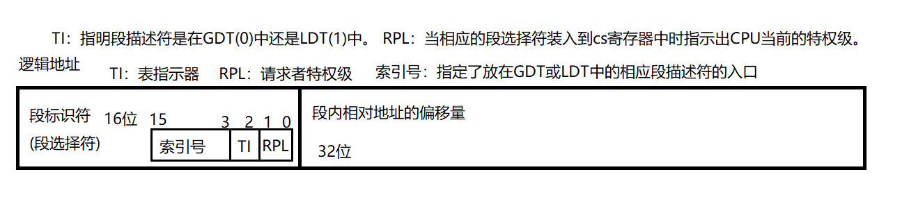
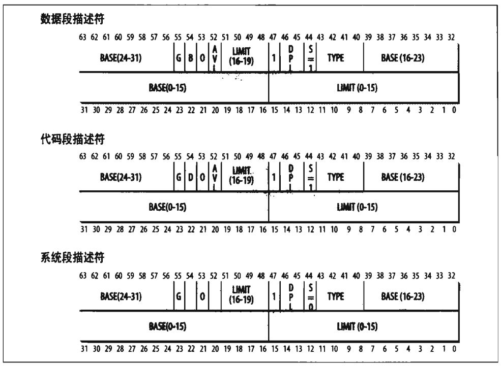
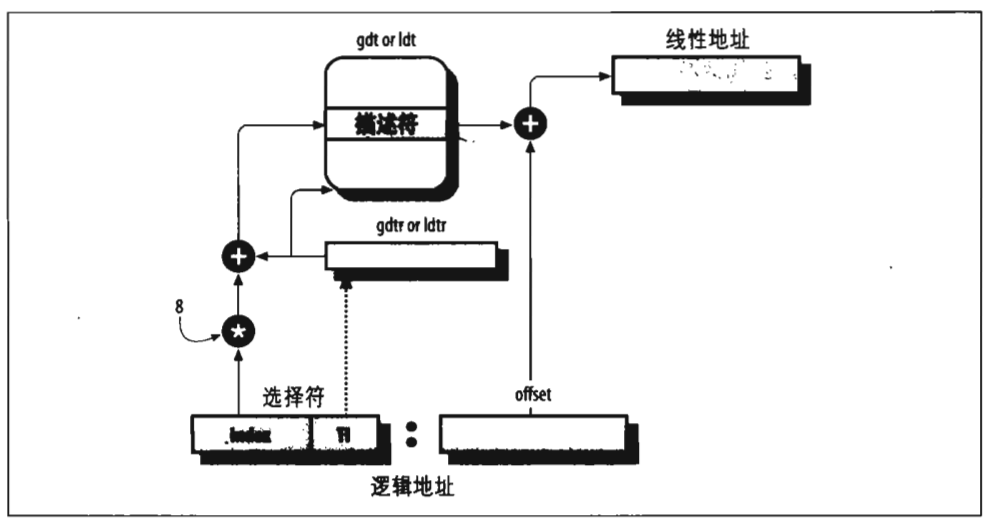

# 深入理解Linux内核

就通过它来学习操作系统

## 第一章：绪论

Linux与一些著名的商用Unix内核到底如何竞争

- 单块结构的内核
- 编译并静态连接的传统Unix内核
- 内核线程
- 多线程应用程序支持
  - 一个多线程用户程序由很多轻量级进程组成，这些进程可能对共同的地址空间、共同的物理内存页、共同的打开文件等等进行操作
- 抢占式内核
- 多处理器支持
- 文件系统
- STREAMS

Linux优势：

- 免费
- 所有成分都可以自己定制
- 可以运行在抵挡、便宜的硬件平台
- 效率高
- 系统稳定
- 内核小，且紧凑
- 与其他通用操作系统高度兼容
- 更快的更新与补丁

为了在硬件无关的源代码与硬件相关的源代码间保持界限，在arch和include目录下包含了23个子目录，以应对Linux支持的不同硬件平台

**多用户操作系统**必须包含的几个特点：

- 核实用户身份的认证机制
- 防止有错误的用户程序妨碍其他应用程序在系统中运行的保护机制
- 防止有恶意的用户程序干涉或窥视其他用户的活动的保护机制
- 限制分配给每个用户的资源数的记账机制

内核体系结构采用微内核模式，微内核操作系统迫使系统程序员采用模块化的方式

模块：一个目标文件，其代码可以在运行时链接到内核或从内核解除链接(这种目标代码通常由一组函数组成，用来实现文件系统、驱动程序或其他内核上层功能)

模块化优点：

- 模块化方法
- 平台无关性
- 节省内存使用
- 无性能损失

文件类型：

- 普通文件
- 目录
- 符号链接
- 面向块的设备文件
- 面向字符的设备文件
- 管道和命名管道
- 套接字

进程是动态的实体，在系统内通常只有有限的生存期。创建、撤销及同步现有进程的任务都委托给内核中的一组历程来完成

内核本身并不是一个进程，而是进程的管理者

Unix系统还包括几个叫做“内核线程”的**特权进程，它们的特点**是：

- 它们以内核态运行在内核地址空间
- 它们不与用户直接交互，因此不需要终端设备
- 它们通常在系统启动时创建，然后一直处于活跃状态直到系统关闭

激活**内核例程**的几种方式：

- 进程调用系统调用
- 正在执行进程的CPU发出一个异常信号，内核代表产生异常的进程处理异常
- 外围设备向CPU发出一个中断信号以通知一个事件的发生，每个中断信号都是由内核中的中断处理程序来处理的
- 内核线程被执行，因为内核线程运行在内核态，因此必须认为其相应程序是内核的一部分

当**内核暂停一个进程的执行**时，就把几个相关处理器寄存器的内容保存到进程描述符中，这些寄存器包括：(当内核决定恢复这个进程时，用进程描述符中合适的字段来装载CPU寄存器)

- 程序计数器(PC)和栈指针(SP)寄存器
- 通用寄存器
- 浮点寄存器
- 包含CPU状态信息的处理器控制寄存器(处理器状态字，Processor Status Word)
- 用来跟踪进程对RAM访问的内存管理寄存器

**虚拟内存**的用途和优点：

- 若干个进程可以并发地执行
- 应用程序所需内存大于可用物理内存时也可以运行
- 程序只有部分代码装入内存时进程可以执行它
- 允许每个进程访问可用物理内存的子集
- 进程可以共享库函数或程序的一个单独映像
- 程序是可以重定位的，也就是说，可以把程序放在物理内存的任何地方
- 程序员可以编写与机器无关的代码，因为他们不必关心有关物理内存的组织结构

***内核内存分配器(KMA)***

它试图满足系统中所有部分对内存的请求。

特点：

- 快，因为它由所有的内核子系统调用
- 必须把内存的浪费减少到最少
- 必须努力减轻内存的碎片问题
- 必须能与其他内存管理子系统合作，以便借用和释放页框

基于各种不同的算法技术，提出几种KMA

- 资源图分配算法
- 2的幂次方空闲链表
- McKusick-Karels分配算法
- 伙伴系统
- Mach的区域分配算法
- Dynix的分配算法
- Solaris的Slab分配算法

使用exec()类系统调用**开始某个程序的执行时**，内核分配给进程的虚拟地址空间由以下内存区组成

- 程序的可执行代码
- 程序的初始化数据
- 程序的未初始化数据
- 初始程序栈(即用户态栈)
- 所需共享库的可执行代码和数据
- 堆(由程序动态请求的内存)

## 第二章：内存寻址

**本章内容:**描述80x86微处理器怎样进行芯片级别的内存寻址，Linux又是如何利用寻址硬件的。

### 1. 内存地址

三种不同的地址：

- 逻辑地址：由段和偏移量组成
- 线性地址(也叫虚拟地址)：一个32位无符号整数，可以表示4GB的地址。从0x00000000到0xffffffff
- 物理地址：用于内存芯片级内存单元寻址。它们与从微处理器的地址引脚发送到内存总线上的电信号相对应

**段寄存器：**它的位移目的就是存放段选择符(也就是逻辑地址的段)，有cs、ss、ds、es、fs和gs

- cs:代码段寄存器，指向包含程序指令的段（它还有一个用途：指明CPU的当前特权级0到3级，**0级是内核态，3级是用户态**）
- ss:栈段寄存器，指向包含当前程序栈的段
- ds:数据段寄存器，指向包含静态数据或者全局数据段
- 其它三个段寄存器没有专门的用途，可以指向任意的数据段

### 2. 硬件中的分段

#### 段描述符

表示一个段描述了段的特征，8字节

它放在全局描述符表(GDT)或局部描述符表(LDT)中

- GDT:在主存中的地址和大小存放在gdtr控制器中
- LDT:是保存每个进程创建的附加段而存在的，当前正被使用的LDT地址和大小放在ldtr控制寄存器中

三种不同的段描述符

- 代码段描述符
  - 表示这个段描述符代表一个代码段，S标志置为1
- 数据段描述符
  - 表示这是一个数据段，S置1，栈段是通过一般的数据段实现的
- 任务状态段描述符(TSSD)
  - 这个段用于保存处理器寄存器的内容。只能出现在GDT中。根据相应的进程是否处于CPU上运行，其Type字段的值分别为11或9。S置0

| 字段名 | 描述 |
|--|--|
| Base | 包含段的首字节的线性地址 |
| G | 粒度标志：如果该位置清零，则段大小以字节为单位，否则以4096字节的倍数计算 |
| Limit | 存放段中最后一个内存单元的偏移量，从而决定段的长度。G:0，段大小:1-1MB字节。否则，4KB-4GB|
| S | 系统标志： 清零：这是一个系统段。否则是一个普通的代码段或数据段 |
| Type | 描述了段的类型特征和它的存取权限 |
| DPL | 描述符特权级字段。用于限制对这个段的存取。表示为访问这个段而要求的CPU最小的优先级 |
| P | Segment-Persent标志：0：表示段当前不在主存上。Linux总是把它置为1，它从不把整个段交换到磁盘上 |
| D或B | 称为D或B的标志，取决于是代码段还是数据段。段偏移量的地址是32位长，就把他置为1。偏移量为16位长，它被清零 |
| AVL标志 | 被忽略 |

#### 访问段描述符

访问段描述符可以有两种方法

- 通过查看GDT或者LDT来得到段描述符
- 通过查看特殊的非编程CPU寄存器

目的：加速逻辑地址到线性地址的转换

通过段选择符去LDT或GDT查找段描述符，找到后会把段描述符存入非编程的特殊CPU寄存器中，后续再进行段的地址转换就不需要去访问LDT或GDT了，只需要访问CPU寄存器。(只有段寄存器的内容改变的时候，才会去访问LDT或GDT)

#### 逻辑地址转换为线性地址

1. 检查段选择符的TI字段，查看段描述符保存在哪个表中
2. 从段选择符的index字段计算段描述符的地址(index字段值乘8)
3. 把逻辑地址的偏移量与段描述符Base字段的值相加

### 3. Linux中的分段

### 4. 硬件中的分页

### 5. Linux中的分页

## 第三章：进程

## 第四章：中断和异常

## 第五章：内核同步

## 第六章：定时测量

## 第七章：进程调度

## 第八章：内存管理

**本章内容：**讨论内核怎样给自己分配主存

## 第九章：进程地址空间

**本章内容：**考虑怎样给进程分配线性地址

## 第十章：系统调用

## 第十一章：信号

## 第十二章：虚拟文件系统

## 第十三章：I/O体系结构和设备驱动程序

## 第十四章：块设备驱动程序

## 第十五章：页高速缓存

## 第十六章：访问文件

## 第十七章：回收叶框

## 第十八章：Ext2和Ext3文件系统

## 第十九章：进程通信

## 第二十章：程序的执行
